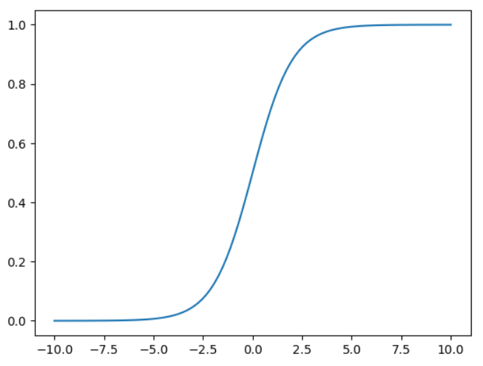
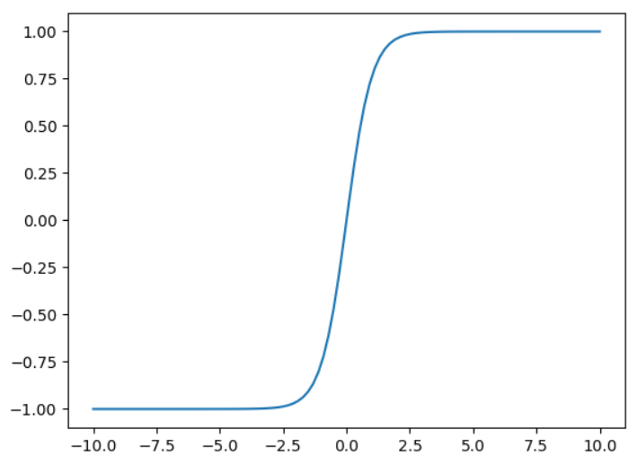
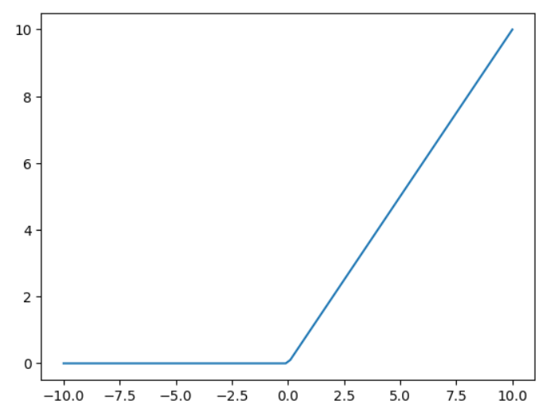

# Machine Learning Framework
This project contains a machine learning framework which can be used to train neural networks for regression, binary classification as well as multiclass classification. Additionally, it contains a metrics class which can be used to aquire things like the models accuracy, confusion matrix or the F1 score. It also includes ways to apply feature scaling.

# Installation and updating
To install the project, simply use the following command in your command line:
`pip install git+https://github.com/melina-heinisch/machine-learning-framework.git`

To update the project, you can use the same command but add "--upgrade" after install to it like so:
`pip install --upgrade  git+https://github.com/melina-heinisch/machine-learning-framework.git`

Note that you need a working Python installation for the "pip" command to work. You can find more resources here: [Download Python](https://www.python.org/downloads/)

# Contents
## Activation functions
You can choose between three different activation functions to train your model. You can import them simply by using the name of the respective function like so:
```python
from machine-learning-framework import sigmoid, tanh, relu
```

They all take the same parameters, the first being `z` which are the weighted inputs. The second parameter is `derived` which decides whether to use the regular or derived activation function. If no value for `derived` is passed, it uses the default `derived = False`.

### Sigmoid
The sigmoid activation function is a commonly used non-linear activation function in neural networks. It maps any input value to a value between 0 and 1, making it useful for binary classification problems. It looks like this:



Advantageous properties include:
- Non-linearity: For modeling complex relationships between input and output variables.
- Smoothness: Is it has a continuous derivative, which is especially useful for optimization algorithms like gradient descent
- Squashes output values to a value between 0 and 1: Thus useful for binary classification problems

### Tanh
The tanh (hyperbolic tangent) activation function is a popular non-linear activation function used in neural networks. It maps any input value to a value between -1 and 1, making it useful for symmetric data. It looks like this:



Advantageous properties include:
- Non-linearity: For modeling complex relationships between input and output variables.
- Smoothness: Is it has a continuous derivative, which is especially useful for optimization algorithms like gradient descent
- Squashes output values to a value between -1 and 1: Thus useful for binary classification problems
- Zero-centered output: Unlike the sigmoid function, the tanh function maps any input value to a value between -1 and 1, with a center point at 0. This property can be useful for training neural networks, as it can help the model converge faster.

### Relu
The ReLU (Rectified Linear Unit) activation function is a popular non-linear activation function used in neural networks. It is a piecewise linear function that returns the input value if it is positive, and 0 otherwise. It looks like this:



Advantageous properties include:
- Piecewise linear: For modeling complex relationships between input and output variables.
- Sparsity: The ReLU function can produce sparse representations, as it sets negative values to 0. Can be useful for reducing overfitting and improving the generalization ability
- Non-saturating: The ReLU function does not saturate for large input values, unlike the sigmoid and tanh functions, which can lead to slow convergence during training.
- Rectifying effect: Can be useful for models that need to learn features that are sensitive to positive values, such as image recognition tasks

## Cost functions
Depending on the type of problem you are training you neural network on, a different cost function will be used. You do not need to import and define these yourself, the right function will be chosen automatically by the type you specify (see more at [Neural Network - Initalization](#initialization))

They all take the same parameters. The first is `O` which stands for the predicted values. The second is `Y` which stands for the ground truth values.
### Categorical Cross Entropy and Softmax
The categorical cross entropy is being used for multiclass classification and  measures the difference between the predicted probability distribution and the true probability distribution over the possible class labels.
In addition to the categorical cross entropy, multiclass classification also uses the softmax function. The output of the network is passed through the softmax function to get a probability distribution over the possible class labels, which put simple means all the values of the output neurons will sum up to 1 after applying the softmax function. The class label with the highest probability is then chosen as the predicted label for the input.
### Cross Entropy
The cross entropy is used for binary classification. It measures how well the predicted probability distribution matches the true probability distribution.
### Mean Squared Error
The mean squared error is used for regression tasks. It measures the average squared difference between the predicted and true values of a continuous variable.

## Optimizers
The optimizer is responsible for adjusting the weights and biases of the model in order to minimize the loss function. You can import it like this:
```python
from machine-learning-framework import gradient_descent
```

### Gradient Descent
The basic idea of gradient descent is to compute the gradient of the loss function with respect to each parameter of the model, which gives us the direction in which the loss function is decreasing the fastest. We then update each parameter in the opposite direction of the gradient, so that the loss function decreases with each iteration.

The function has the following parameters:
- `weights`: The current weights of the neural net
- `biases`: The current biases of the neural net
- `dW`: The delta (gradient of change) for the weights
- `db`: The delta (gradient of change) for the bias
- `alpha`: Our learning rate
- `lambda_`: The regularization parameter
- `m`: Number of samples

## Neural Net
The Neural Net class is the heart of the framework. It is responsible for training your neural network and giving predictions for new data.

### Initialization
You can import the Neural Net class like this:

```python
from machine-learning-framework import NeuralNet
```

In order to create your neural network you need to specify its type, among other things. The type is an enum, structured as subclass of the Neural net and can be accessed like so:
```python
NeuralNet.Type.MUTILCLASS_CLASSIFICATION
NeuralNet.Type.BINARY_CLASSIFICATION
NeuralNet.Type.Regression
```
As you can see, there are three different types: Multiclass classification, binary classification and regression. You need to choose the appropriate type for your data and goals.

In order to initalize you Neural network, you need the following parameters:
- `layer_sizes`: The sizes of your input, hidden, and output layers, gives as an array
- `type`: One of the three defined types
- `activation_fn`: The activation function of your choice
- `optimizer_fn`: The optimizer of your choice
- `weights` (optional, Default: `None`): If used for prediction only, you can pass already trained weights; if none are passed, they are instanciated randomly
- `biases` (optional, Default: `None`): If used for prediction only, you can pass already trained biases; if none are passed, they are instanciated randomly

An example of initalizing the neural net for training could look like this:

```python
layer_size = [225, 16, 16, 11]
neural_net = NeuralNet(layer_size, NeuralNet.Type.MUTILCLASS_CLASSIFICATION, tanh, gradient_descent)
```
### Train
You can call this method on you perviously created instance of a neural net. It will start the whole traing process of your neural net including forward pass, backward pass and adjusting of weights and biases.

You need to pass the following parameters:
- `X_train`: The training data
- `y_train`: The ground truth of your training data
- `alpha`: The learning rate
- `iterations`: Number of iterations it should train for
- `lambda_`: Regulariation parameter
- `X_validate` (optional, Default: `None`): The validation data
- `y_validate` (optional, Default: `None`): The ground truth of the valiation data

It will return the following variables:
- `weights`: The trained weights of your model
- `biases`: The trained bias of your model
- `error_history_train`: The error of every 10th iteration on training data, saved as an array to evaluate training progress
- `error_history_validate`: The error of every 10th iteration on validation data, saved as an array to evaluate training progress

As you can see, it is optional to pass validation data. If none are passed, the `error_history_validate` will return an empty array. 
It is important to note that for multiclass classification, the ground truth needs to be one hot encoded before passing it to the model. You can use the method `get_one_hot` specified in `helpers.py` to do this. You can import it just like the previous methods.

An example usage of this method would look like this:

```python
weights, biases, error_history, error_history_validate = neural_net.train(X_train, Y_train, 0.001,500,0.2, X_validation, Y_validation)
```

### Predict
Once you have trained a model, you can use it to make predictions. You can either use the same instance used for training your data, or you save the previously trained weights and biases and create a new instance with these weights and biases.

It only takes one parameter, `X`, which is the sample of data you would like the prediction for. It returns one value, namely the prediction. Note that for multiclass classification the return value is still one hot encoded.

You can use the predict method like this: 

```python
result = neural_net.predict(data)
```
## Feature scaling
This framework also offers the possibility to apply feature scaling to your data. This is helpful to improve performance and interpretability of machine learning models, as well as simplify the data preparation process. To do this, you can choose between two different scalers which can be imported like so: 

```python
from machine-learning-framework import StandardScaler, NormalScaler
```

### Standard Scaler
This scaler uses standardization. Standardization is used to rescale the data to have zero mean and unit variance. This is done by subtracting the mean of each feature from the data and dividing by its standard deviation.

### Normal Scaler
This scaler uses standardization. Normalization is used to rescale the data to have values between 0 and 1. This is done by subtracting the minimum value of each feature from the data and dividing by the range of the feature.

## Authors and acknowledgment
This Machine Learning Framework was created by Melina Heinisch.

## Project status
This Framework has beed developed within the Machine Learning course of the winter semester 22/23. Upon hand in at the beginning of April 2023, this project will not be maintained any further.